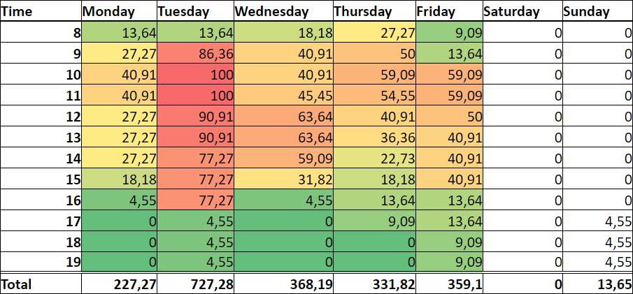

# shiftScheduler
Simple scheduler for finding office hours least occupied by other events through user Google Calendars, using OAuth 2.0

## Setup

### Requires:
- Python 3.*
- One or more Google calendars on a google account

```Shell
git clone https://github.com/wernersa/shiftScheduler
cd shiftScheduler

# Optional virtualenv:
virtualenv venv
activate venv

pip install -r requirements.txt

python run.py
```

### Acquiring the OAuth 2.0 client key

Download a `client_secret.json` file from Google's API Console to the scripts folder.
The following instruction is copied from [Google's API documentation](https://developers.google.com/api-client-library/python/auth/web-app)

> ## Create authorization credentials
> Any application that uses OAuth 2.0 to access Google APIs must have authorization credentials that identify the application to Google's OAuth 2.0 server. The following steps explain how to create credentials for your project. Your applications can then use the credentials to access APIs that you have enabled for that project.
> - Open the [Credentials page](https://console.developers.google.com/apis/credentials) in the API Console.
> - Click Create credentials > OAuth client ID.
> - Complete the form. Set the application type to Web application. Applications that use languages and frameworks like PHP, Java, Python, Ruby, and .NET must specify authorized redirect URIs. The redirect URIs are the endpoints to which the OAuth 2.0 server can send responses. For testing, you can specify URIs that refer to the local machine, such as http://localhost:8080.
>
> We recommend that you design your app's auth endpoints so that your application does not expose authorization codes to other resources on the page.
After creating your credentials, download the client_secrets.json file and securely store it in a location that only your application can access.
> 
> > Important: Do not store the client_secrets.json file in a publicly-accessible location. In addition, if you share the source code to your application—for example, on GitHub—store the client_secrets.json file outside of your source tree to avoid inadvertently sharing your client credentials.

## Script Output
Parses your selected google calendars and outputs a `.csv` file with your weekday availability. The scripts weights availability relative to the week hour you're least available, making a range from 100 (least available) to 0 (completely free).

Example output:

|      | Monday | Tuesday | Wednesday | Thursday | Friday | Saturday | Sunday | 
| ---- |--------|---------|-----------|----------|--------|----------|--------| 
| 8   | 13.64  | 13.64   | 18.18     | 27.27    | 9.09   | 0.0      | 0.0    | 
| 9   | 27.27  | 86.36   | 40.91     | 50.0     | 13.64  | 0.0      | 0.0    | 
| 10  | 40.91  | 100.0   | 40.91     | 59.09    | 59.09  | 0.0      | 0.0    | 
| 11  | 40.91  | 100.0   | 45.45     | 54.55    | 59.09  | 0.0      | 0.0    | 
| 12  | 27.27  | 90.91   | 63.64     | 40.91    | 50.0   | 0.0      | 0.0    | 
| 13  | 27.27  | 90.91   | 63.64     | 36.36    | 40.91  | 0.0      | 0.0    | 
| 14  | 27.27  | 77.27   | 59.09     | 22.73    | 40.91  | 0.0      | 0.0    | 
| 15  | 18.18  | 77.27   | 31.82     | 18.18    | 40.91  | 0.0      | 0.0    | 
| 16  | 4.55   | 77.27   | 4.55      | 13.64    | 13.64  | 0.0      | 0.0    | 
| 17  | 0.0    | 4.55    | 0.0       | 9.09     | 13.64  | 0.0      | 4.55   | 
| 18  | 0.0    | 4.55    | 0.0       | 0.0      | 9.09   | 0.0      | 4.55   | 
| 19  | 0.0    | 4.55    | 0.0       | 0.0      | 9.09   | 0.0      | 4.55   | 
| 20  | 0.0    | 4.55    | 0.0       | 0.0      | 4.55   | 0.0      | 4.55   | 


Some small magic in excel and you'll have this:

